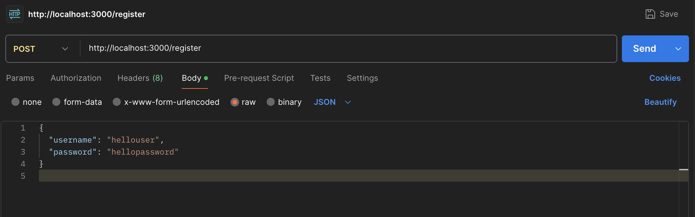
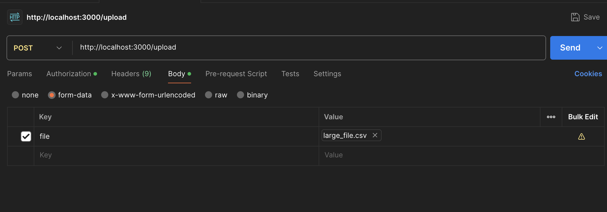
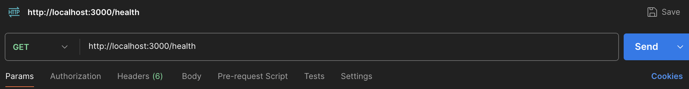

# BFFFileHandlerAltar

## How to setup

The first step is to clone this repository:

```bash
git clone https://github.com/peedrou/BFFFileHandlerAltar.git
```

Navigate to the project directory:

```bash
cd project-directory
```

In order to setup the project running on your machine, you need:

- [Node.js]
- [npm]
- [docker]
- [Postman] (Optional but recommended)

Once you make sure you have everything necessary, install the dependencies:

```bash
npm install
```

Afterwards, run docker compose:

```bash
docker compose up -d
```

This will make sure our postgres database is up and running, the docker-compose already references an init.sql script that automatically creates the Users table to be used for authentication

Rename the .env.template file to .env with your required external dependencies

```.env
DEPENDENCIES="['https://www.google.com', 'https://www.altar.io']"
```

## Start the Project

Once everything is setup, you can run the application for dev, it will automatically set port 3000 unless specified in a .env file:

```bash
npm run dev
```

The application is now listening on https://localhost:3000

## Testing the applications

First thing, run the generate_csv.sh script to create a .csv file for us:

```bash
chmod +x ./.scripts/generate_csv.sh
./.scripts/generate_csv.sh
```

There are two ways to test the application, you can either check both integration tests and unit tests by running:

```bash
npm run test:unit
npm run test:integration
```

Or you can test it with Postman, by configuring for the three possible endpoints:

- [/register] [POST] - Creates a new user on the postgres DB with a hashed password
  

- [/upload] [POST] - Using the form-data Content-Type and your user credentials, uploads a .csv file and stores it under /app/uploads/
  

- [/health] [GET] - Gets the current CPU pressure, available memory and external dependencies
  

## Database vizualization

To see the data currently inside our Users table after registering your user, you can run:

```bash
docker ps
```

Once you see your container id:

```bash
docker exec -it <your containter id> bash
```

This will open a bash terminal inside your container where you can now run:

```bash
psql -U root -d database_test
```

Now run:

```sql
SELECT * FROM Users;
```

once inside you will see something like:


## Considerations (what I was not able to do)

Altough it is possible to test with success in postman the upload of a file (and its subsequent rate limiter logic), I could not replicate this in the integration tests, there are several reasons why this could happen but my idea is that the supertests package is not made to handle the attachment of large files in in multipart/form-data, as tests like:

```typescript
it('should upload file with correct authentication', async () => {
  const response = await request(app)
    .post('/upload')
    .auth('hellouser', 'hellopassword')
    .attach('file', filePath)
    .expect(200);

  expect(response.body.message).toBe('File uploaded successfully');
});
```

This test will always throw a timeout, even when we pass the file´s Stream or Buffer, when I tried to replicate this with a similar configuration, but just to send a very large string, it was successful until the string size was too big, the file stream is as big as this string, so I would most likely have to increase the timeout of the test substantially, which is not ideal.

When I tried to test with another library the same post request, I received similar results. It would be interesting to see how this could be resolved, but due to lack of time I will not be able to see through it.

### Circuit Breaker

Altough the Circuit Breaker logic is in theory correct, I´m having issues reproducing cohesive tests, due to lack of time I cannot explore this further.

## Pipelines

I created a simple github actions pipeline to run the unit tests when the code is pulled to develop or main:

```yaml
name: Testing Pipeline

on:
  push:
    branches:
      - main
      - develop
  pull_request:
    branches:
      - main
      - develop

jobs:
  test:
    runs-on: ubuntu-latest

    strategy:
      matrix:
        node-version: [23.x]

    steps:
      - name: Checkout code
        uses: actions/checkout@v3

      - name: Set up Node.js
        uses: actions/setup-node@v3
        with:
          node-version: ${{ matrix.node-version }}

      - name: Install dependencies
        run: |
          npm install

      - name: Build the application
        run: |
          npm run build

      - name: Run unit tests
        run: |
          npm run test:unit
```
