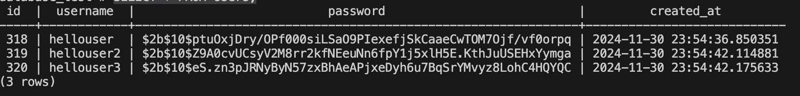

# BFFFileHandlerAltar

## How to setup

The first step is to clone this repository:

```bash
git clone https://github.com/peedrou/BFFFileHandlerAltar.git
```

Navigate to the project directory:

```bash
cd project-directory
```

In order to setup the project running on your machine, you need:

- [Node.js]
- [npm]
- [docker]
- [Postman] (Optional but recommended)

Once you make sure you have everything necessary, install the dependencies:

```bash
npm install
```

Afterwards, run docker compose:

```bash
docker compose up -d
```

This will make sure our postgres database is up and running, the docker-compose already references an init.sql script that automatically creates the Users table to be used for authentication

## Start the Project

Once everything is setup, you can run the application for dev, it will automatically set port 3000 unless specified in a .env file:

```bash
npm run dev
```

The application is now listening on https://localhost:3000

## Testing the applications

First thing, run the generate_csv.sh script to create a .csv file for us:

```bash
chmod +x ./.scripts/generate_csv.sh
./.scripts/generate_csv.sh
```

There are two ways to test the application, you can either check both integration tests and unit tests by running:

```bash
npm run test:unit
npm run test:integration
```

Or you can test it with Postman, by configuring for the three possible endpoints:

- [/register] [POST] - Creates a new user on the postgres DB with a hashed password
  

- [/upload] [POST] - Using the form-data Content-Type and your user credentials, uploads a .csv file and stores it under /app/uploads/
  

- [/health] [GET] - Gets the current CPU pressure, available memory and external dependencies
  

## Database vizualization

To see the data currently inside our Users table after registering your user, you can run:

```bash
docker ps
```

Once you see your container id:

```bash
docker exec -it <your containter id> bash
```

This will open a bash terminal inside your container where you can now run:

```bash
psql -U root -d database_test
```

Now run:

```sql
SELECT * FROM Users;
```

once inside you will see something like:


